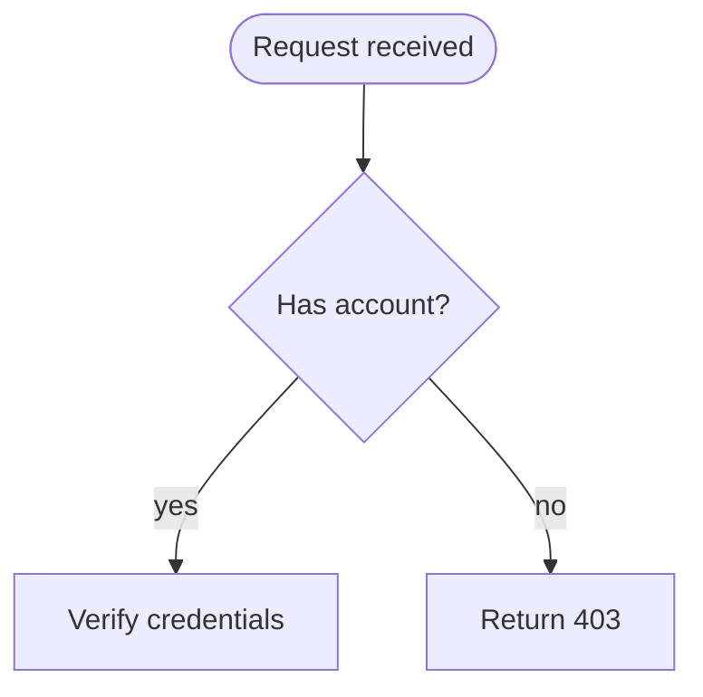
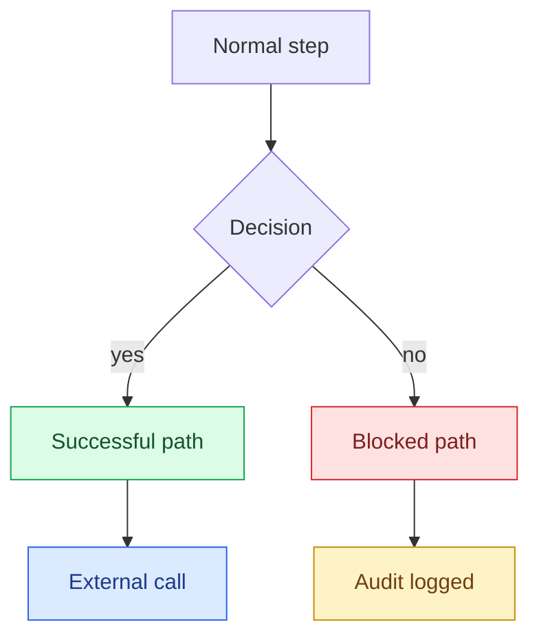

# wiki-mermaid

## Purpose

Mermaid diagrams ship the picture inside the markdown. Done well, they survive grep, render on GitHub Wiki / GitLab / Azure DevOps without extra tooling, and let the next maintainer change one node without redrawing the whole picture. Done poorly, they become 60-node rats' nests in landscape orientation with file-path labels and embedded secrets.

This skill owns the small rule set that keeps diagrams legible across the wiki.

## When to use

Activate when:

- Adding a new Mermaid block to a wiki page.
- Editing an existing Mermaid block.
- Refactoring a business diagram that imported code-path details.
- Migrating a diagram from another format (Visio / draw.io / PNG) into Mermaid.

Skip when:

- The diagram is a one-off whiteboard sketch (use a PNG attached to the page if necessary; do not invest in Mermaid for throwaway).
- The diagram is an **actor-lane / BPMN swimlane** — delegate to `wiki-plantuml`. Mermaid has no swimlane primitive; faking lanes with `subgraph` does not align them (and Azure DevOps forbids subgraph links, killing the cross-lane handoff arrows). No wiki renders swimlanes natively, so they are pre-rendered images.

## Inputs

- The wiki page in scope.
- The diagram's purpose: business process / user flow / system architecture / sequence / data model.
- The audience: engineers / operators / business owners / external auditors.

## Direction default — `flowchart TD` (top-down)



- **TD (top-down)** for process flows that have a single entry and a small number of exits.
- **LR (left-right)** for pipelines with many parallel branches or wide-fan-out architectures.
- **TB / BT / RL** are valid but uncommon; pick one of TD or LR and stay consistent across a wiki.

Reason: wiki pages render in a vertical column. Top-down flows match the page direction; left-right flows force horizontal scroll for large diagrams.

## Shape vocabulary (meanings fixed)

A small set of shapes with stable meanings. Use ONLY these — adding more shapes adds noise without adding clarity.

| Shape | Syntax | Meaning |
|---|---|---|
| Stadium | `(["Label"])` | Start / End nodes (entry / exit) |
| Rectangle | `["Label"]` | Action / step (something happens) |
| Diamond | `{"Label"}` | Decision (yes / no / multi-branch) |
| Cylinder | `[("Label")]` | Data store (database / cache / queue) |
| Parallelogram | `[/"Label"/]` | Input / output (user-facing or external) |
| Hexagon | `{{"Label"}}` | Preparation / configuration step |

Anti-shapes (do NOT introduce):

- Circles, double-circles, asymmetric shapes, custom SVG. They confuse Mermaid's auto-layout and add no semantic value.

## Four-class colour palette



| Class | Fill | Stroke | Text | Meaning |
|---|---|---|---|---|
| `ok` | `#dcfce7` | `#16a34a` | `#14532d` | Successful path, allowed outcome |
| `block` | `#fee2e2` | `#dc2626` | `#7f1d1d` | Blocked / rejected / error path |
| `ext` | `#dbeafe` | `#2563eb` | `#1e3a8a` | External service, third-party, out-of-band |
| `audit` | `#fef3c7` | `#ca8a04` | `#713f12` | Audit / logging / compliance side effect |

Why four:

- More classes → readers cannot remember the mapping. Four is the comfort ceiling.
- The palette is colour-blind-aware (the hue + saturation combinations remain distinguishable).
- The text-on-fill contrast meets WCAG AA at the diagram's typical render size.

Default (untyped) nodes inherit Mermaid's default fill — neutral, semantically meaningless. Use it for "normal steps in the happy path."

### Reuse the project's existing palette

The four-class palette above is the **default** for a wiki with no established convention. If the project already has a house palette, reuse THAT mapping — consistency within a wiki beats matching this skill's defaults. Whichever palette wins, keep the class count low and the meaning of each class stable across every diagram in the wiki.

## Label hygiene

Rules for every label:

| Rule | Why | Example |
|---|---|---|
| Title Case for nouns | Reads as a thing, not a sentence | `Verify Credentials` not `verify credentials` |
| Imperative for actions | Action steps are commands, not descriptions | `Send Confirmation` not `Sending confirmation` |
| Question for decisions | A diamond IS a question | `Has Active Subscription?` not `Subscription Check` |
| Max ~30 characters | Auto-layout collapses around long labels | `Issue Refund` not `Issue Refund to Original Payment Method` |
| No inline code | Backticks confuse some renderers; labels are not code | `Send SMS` not `` `sms.send()` `` |
| No file paths | Business diagrams describe domain, not files | `Calculate Tax` not `src/services/tax.ts` |
| No secrets / tokens / customer data | Diagrams ship as plain text in wiki | `Send Email` not `Send Email to customer@real.com` |
| No emoji in node labels | Some renderers garble them; greppability suffers | use color class for emphasis |

## Code-path scrub for business diagrams

A business-process diagram describes WHAT happens and WHO decides — not which module runs.

```
BUSINESS DIAGRAM                    NOT THIS (code diagram)
+---------------------+             +---------------------+
| User submits form   |             | POST /api/order     |
+---------+-----------+             | → orders.controller |
          v                         | → orders.service    |
+---------+-----------+             | → orders.repository |
| Validate inventory  |             | → db.orders.insert  |
+---------+-----------+             +---------------------+
          v
+---------+-----------+
| Reserve inventory   |
+---------------------+
```

The left version is durable: it survives refactors, microservice splits, framework changes. The right version rots the day the codebase moves.

Code diagrams (sequence diagrams of HTTP exchanges, ER diagrams of tables, deployment diagrams of components) are legitimate — but they live on engineering pages, not on business / operator pages. Tag them explicitly:

```markdown
## Sequence (engineering reference)
```

vs

```markdown
## Process
```

## Diagrams must not alter business meaning

A diagram **transcribes** a documented flow; it never **authors** one. It must not introduce a rule, branch, decision outcome, actor, or state that is absent from the source page. A diamond's yes/no branches, an SLA threshold, an ordering constraint — each must match the source-of-truth page in meaning, not merely in wording.

This is the **meaning-preservation companion** to the code-path scrub above, and it is orthogonal to it:

- The **code-path scrub** bans the *form* of a label — file paths, module names, secrets — on a business diagram.
- This gate bans **new business semantics** — a faithful, scrub-clean label can still smuggle in an undocumented rule (a branch the spec never states, an actor the spec never names, a threshold no page sets).

A diagram passes the scrub and still fails here if it adds meaning the owning page does not carry. The authoritative rules and the full state machine live on the owning specification page — governed by `wiki-source-of-truth`; this skill only places the diagram and forbids it from restating or inventing those rules.

## Diagram type defaults

| Purpose | Mermaid type | Notes |
|---|---|---|
| Process / decision flow | `flowchart TD` | Most common |
| Two-actor exchange (request / response) | `sequenceDiagram` | One per scenario; do not collapse multiple |
| Data model | `erDiagram` | Use for entities, not for code classes |
| State machine | `stateDiagram-v2` | Use for explicit state transitions (order: pending → paid → shipped) |
| Timeline / Gantt | `gantt` | For project timelines; not for daily process |
| Architecture | `flowchart LR` with `subgraph` | Group by tier; use `ext` class for third-party |

Skip:

- `pie` (pie charts in a process wiki are usually a smell; use a table)
- `mindmap` (rarely renders well; usually a brain dump)
- `journey` (rarely useful in operator/business wikis)

## Diagram altitude (where each diagram size lives)

Match each diagram's size to the page's role. A page that orients carries a small map; a page that walks one journey carries one focused diagram; the full machine lives on the page that owns the rules. One altitude per page keeps each diagram single-sourced.

| Page role | Diagram altitude | Example |
|---|---|---|
| Hub / landing page | Compact orientation map — a few nodes showing how the pieces connect | `Provision --> Configure` |
| Child / journey page | One focused diagram of that single workflow, at journey altitude | The submit-and-approve journey, end to end, for that one flow |
| Owning specification page | The full state machine, owned here and only here | A letter lifecycle `Pending --> ... --> Archived` |

A journey page **references** the full state machine on the owning specification page; it never redraws it. Duplicating the full diagram across altitudes guarantees drift — one altitude per page keeps each diagram single-sourced, so a change is made in exactly one place.

(Section labels — hub, journey page, owning specification page — and the hub-first themed IA they sit in are owned by `wiki-structure`.)

## Single master swimlane — exactly once

The one end-to-end actor-lane **master swimlane** — the full lifecycle, one lane per actor — lives in exactly ONE place: the workflow hub page, at overview altitude. NEVER duplicate it onto a child or journey page. A journey page links up to the hub for the end-to-end view and shows only its own focused diagram (see the altitude rule above).

Example (an example, not a requirement): a validated master swimlane covered nine actor lanes — platform admin, tenant admin, author/sender, approver/manager, reviewer, receiver, auditor, external partner, and the system. The lane count follows the project; the rule is the placement, not the number.

This is a **placement** rule, not a rendering rule. When the master swimlane is a true BPMN swimlane it is authored via `wiki-plantuml` — this skill owns only "exactly once, on the hub"; `wiki-plantuml` owns how it renders (see "Skip when" and Cross-references for the Mermaid-lanes-vs-true-BPMN trade-off).

## Diagram-as-source rule

The `.md` file's Mermaid block IS the source of truth. Do NOT:

- Paste rendered PNGs of the same diagram alongside the source (they go stale on the first edit).
- Maintain the diagram in a separate tool (draw.io, Lucid, Miro) and re-export. Single-source the Mermaid; reference the external tool only if Mermaid genuinely cannot express the diagram (rare).

Exception: a high-fidelity architecture diagram that needs custom layout / custom icons / multi-page navigation may justify staying in a dedicated tool. Then ship a screenshot in the wiki AND link to the source tool. Tag the screenshot's source.

## Safety gates

- **Never** include secrets, tokens, credentials, real customer identifiers, or real internal hostnames in diagram labels.
- **Never** include code path labels (file paths, function names, module names) in business diagrams.
- **Never** introduce new shapes beyond the vocabulary.
- **Never** introduce new colour classes beyond the four-class palette without surfacing the proposal to the user.
- **Never** keep a stale PNG alongside the live Mermaid source.
- **Never** duplicate the single master swimlane onto a child/journey page — it lives once on the workflow hub.
- **Never** let a diagram introduce a business rule/branch/outcome absent from the source/spec page — diagrams transcribe, they do not author.

## Validation checklist

Before committing a diagram change:

- [ ] Direction is `TD` (default) or `LR` (justified).
- [ ] Every shape is from the fixed vocabulary.
- [ ] Every coloured node uses one of the four classes.
- [ ] Every label is Title Case (nouns), imperative (actions), or question form (decisions).
- [ ] No inline code, no file paths, no secrets, no real PII in labels.
- [ ] Business diagram does not contain code-path nodes; if it does, move to a separate "engineering reference" section.
- [ ] No stale PNG of the same diagram alongside.
- [ ] The master/end-to-end swimlane appears exactly once (on the workflow hub), not duplicated onto child/journey pages.
- [ ] The diagram introduces no business rule/branch/outcome/actor/state absent from the owning source page (transcribes, does not author).
- [ ] If the target is Azure DevOps Wiki: `::: mermaid` colon-container (not ` ```mermaid `), `graph` (not `flowchart`), and no subgraph links.
- [ ] Mermaid block renders cleanly (paste-test on the target wiki platform — view the rendered page, do not trust the markdown or the docs).

## Output format

When generating a new diagram, output the Mermaid block ready to paste. Include the `classDef` and `class` lines if any node is coloured.

When auditing existing diagrams, output a per-block findings table:

```
DIAGRAM AUDIT — <wiki-page>
  Block 1 (line N)
    Direction: TD — OK
    Shape violations: 0
    Colour violations: 1 — `customClass` not in palette
    Label hygiene: 2 — inline code in node X; file path in node Y
    Code-path scrub: FAIL — node "src/handlers/order.ts" looks like a code path
    Verdict: MEDIUM — surface to maintainer for cleanup
```

## Anti-patterns (and why)

| Anti-pattern | Why it's wrong | Correct |
|---|---|---|
| 50-node flowchart in LR with horizontal scroll | Unreadable; nobody scrolls | Decompose into multiple smaller TD flowcharts |
| Six different colours, no legend | Reader cannot remember meanings | Four-class palette; consistent across wiki |
| Inline-code labels (`` `processOrder()` ``) | Couples to code; rots on rename | Use the business action ("Process Order") |
| File-path labels (`src/services/order.ts`) | Couples to file layout; rots on refactor | Use the business action |
| Real customer email in label | PII leaks into wiki | Use placeholder |
| PNG + Mermaid source side-by-side | PNG goes stale; readers trust the wrong one | Source only |
| Sequence diagram on the business overview page | Engineering detail in a business doc | Engineering-reference subsection |
| Circles + cubes + custom shapes | Auto-layout breaks; readers wonder what each means | Fixed vocabulary |
| Untagged colour with stylesheet override | Style intent unclear; renders differently elsewhere | classDef + class |

## Platform compatibility — Azure DevOps Wiki

Azure DevOps Wiki does NOT render Mermaid the GitHub way. A GitHub→Azure copy looks done but **every diagram silently degrades to a raw code block**. Three conversions are mandatory when the target is `azure-devops-wiki`:

| GitHub-flavoured (source) | Azure DevOps Wiki (target) | Why |
|---|---|---|
| ` ```mermaid ` … ` ``` ` code fence | `::: mermaid` … `:::` colon-container | Azure renders Mermaid ONLY inside the colon container; the code fence falls back to plain text. (MS Learn claims both fences work — trust the rendered page, not the docs.) |
| `flowchart TD/LR` | `graph TD/LR` | Azure's restricted parser does not recognise the `flowchart` keyword |
| links to / from a `subgraph` | link the inner nodes instead | `subgraph`→`subgraph` and node→`subgraph` arrows are unsupported |

Supported on Azure unchanged: `sequenceDiagram`, `stateDiagram-v2`, `classDef`, `<br/>`.

GitHub renders the **opposite** way (the colon container does nothing there), so the Azure copy and the GitHub/source copy must **diverge on the fence**. A migration converter must be a stateful line scanner that retargets only the **closing** fence of a mermaid block, so unrelated ` ```bash `/` ``` ` code fences stay intact. CRLF line endings defeat `$`-anchored grep counts — verify conversions with plain-substring counts, not `$`-anchored regex.

For one source that must render on BOTH platforms, prefer `graph` over `flowchart` and avoid subgraph links from the start (both render on GitHub and Azure); the fence is the only irreducible divergence. This makes the skill's `flowchart TD` default and the `flowchart LR` + `subgraph` architecture default GitHub-only — swap them for `graph` when the target includes Azure DevOps.

## Portability rationale

Mermaid renders on:

- GitHub Wiki (native, ` ```mermaid ` code fence)
- GitLab Wiki (native)
- Azure DevOps Wiki (native, but ONLY via the `::: mermaid` colon-container + restricted syntax — see Platform compatibility above)
- MkDocs (with mermaid plugin)
- Most modern Markdown renderers (with mermaid plugin)

The palette hex values and the shape vocabulary (the Mermaid-standard subset) are portable across all of these. What is NOT portable is the **wrapper**: GitHub uses a ` ```mermaid ` code fence and accepts `flowchart`; Azure DevOps Wiki requires the `::: mermaid` colon-container and rejects `flowchart` + subgraph links. Diagram CONTENT is portable; the fence + keyword are platform-specific.

## Cross-references

- `wiki-plantuml` — the peer engine for **BPMN-style swimlanes** (actor lanes / pools), which Mermaid cannot express and no wiki renders natively. Mermaid stays authoritative for flowchart/sequence/state. **Trade-off:** Mermaid lanes faked with `subgraph` do not align as cleanly as a true BPMN pool, and Azure's no-subgraph-links rule kills the cross-lane handoff arrows; an owner MAY still choose Mermaid lanes to stay Mermaid-native — accept the trade-off. For real swimlanes prefer `wiki-plantuml`. This skill owns only the swimlane's placement ("exactly once, on the hub"); `wiki-plantuml` owns the rendering.
- `wiki-source-of-truth` — the owning specification page that holds the full state machine and the authoritative rules a diagram must not restate or invent; those rules are governed there. This skill only places the diagram.
- `wiki-authoring` — where in a page diagrams belong.
- `wiki-safe-updates` — diff preview before applying the diagram change.
- `wiki-link-validation` — if a node label is a clickable wiki link, it follows the link convention.
- `wiki-structure` — the page hosting the diagram follows the structure rules.
