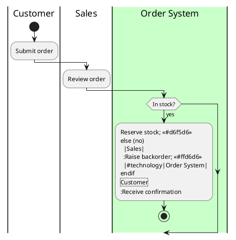

# wiki-plantuml

## Purpose

A swimlane expresses **who does what, in what order, across actor lanes** — the one thing Mermaid `subgraph` lanes and D2 grids cannot enforce, because a cross-lane edge does not pull its target into the downstream lane. For a Blueworks-style BPMN process map (actor lanes + phases + branches), you need a real swimlane primitive.

PlantUML **activity-beta** is the only diagram source that (a) has a first-class swimlane primitive (`|Actor|` lanes with gateways, loops, and backward return paths), (b) is plain text an AI agent can author and `git diff` line-by-line, and (c) is **self-contained** — the new activity engine has its own top-down layout and does **not** need Graphviz. The `.puml` is the source of truth; the rendered SVG/PNG is a build artifact. This skill owns the authoring rules **and** the render-then-embed pipeline that keeps the published image from drifting from the `.puml`.

Neither GitHub Wiki nor Azure DevOps Wiki renders PlantUML natively, so on those two platforms a swimlane is always pre-rendered to an image and embedded. GitLab and MkDocs render the same `.puml` natively. Mermaid stays authoritative for every non-swimlane diagram.

## When to use

Activate when:

- Adding or editing a BPMN-style swimlane / actor-lane / pool process map on a wiki page.
- A Mermaid flow has grown lanes and needs promoting to a real swimlane.
- Migrating a Visio / draw.io pool diagram into diffable text.

Skip (delegate to `wiki-mermaid`) when:

- The diagram is a process/decision flow (`flowchart TD` / `graph TD`), a two-actor exchange (`sequenceDiagram`), or a state machine (`stateDiagram-v2`). These render **natively and inline-editably** on both GitHub Wiki and Azure DevOps Wiki — a swimlane never does, so never pay the render pipeline for a diagram Mermaid draws for free.

Escalate (surface to the user, do **not** author) when:

- Strict OMG BPMN 2.0 fidelity is the requirement — pools / message-flows / boundary-events / executable Camunda-Zeebe, or a real `.bpmn` is already the source of truth. That belongs to **bpmn.io / bpmn-to-image** (heavy: Node + ~200 MB headless Chromium). Activity-beta lanes are illustrative actor lanes, not full BPMN.

## Inputs (adapter)

- The wiki page in scope **and its wiki flavour** (`github-wiki` / `azure-devops-wiki` / `gitlab-wiki` / `mkdocs`) — drives the embed track.
- **The source of the lanes/steps** — the epic / process doc / code path the swimlane describes. **Rule: derive lanes and steps from this source; NEVER invent an actor or a step not present in it.**
- `renderMode` — `local` (default, privacy-safe) | `kroki` (a **self-hosted** endpoint URL is required).
- Output format preference — **PNG** (safe default on GitHub/Azure) vs **SVG** (crisp, searchable; only where the platform renders it). Defaults per flavour — see the pipeline section.
- `epic` + `slug` — compose the artifact name `swimlane-<epic>-<slug>.(puml|svg|png)`.

Adapter cache (`.docs-wiki.local.json`) keys this skill reads/writes: `javaExe`, `plantumlJar`, `renderMode`, `krokiEndpoint`, `org`, `projectGuid`, `wikiId`, `attachmentApiVersion` (default `7.1`), `swimlaneNaming` (default `swimlane-<epic>-<slug>`), `palette` (ok/block hex).

## Scope boundary — the one crisp rule

> **PlantUML owns swimlanes ONLY.** Mermaid stays authoritative for `flowchart`/`sequence`/`state` — every diagram that renders natively and inline-editably on **both** GitHub Wiki and Azure DevOps Wiki. Actor-lane / BPMN-pool swimlanes — which render natively on **neither** — are delegated here to PlantUML activity-beta (primary) or bpmn.io (escalation).

| Diagram | Engine | Why |
|---|---|---|
| Process / decision flow | Mermaid `flowchart`/`graph TD` (see `wiki-mermaid`) | Native + inline-editable on both platforms |
| Two-actor request/response | Mermaid `sequenceDiagram` | Native + inline-editable on both platforms |
| State machine | Mermaid `stateDiagram-v2` | Native + inline-editable on both platforms |
| **Actor-lane swimlane / pool** | **PlantUML activity-beta (THIS skill)** | No wiki renders it natively → pre-render + embed |
| Strict OMG BPMN 2.0 | bpmn.io / bpmn-to-image (escalation) | Real `.bpmn`; heavy headless render |

**Hard anti-rule:** do **not** fake a swimlane with Mermaid `subgraph` lanes — dagre will not align lanes, per-subgraph direction is ignored, and Azure DevOps additionally forbids links to/from a `subgraph`, which kills the cross-lane handoff arrows that are the entire point of a swimlane.

## Swimlane authoring rules (activity-beta)

Every swimlane follows this skeleton:



| Rule | Why | Example |
|---|---|---|
| `\|Actor\|` pipe lanes, one human/role per lane | Lanes are the whole point — one owner per column | `\|Customer\|`, `\|Sales\|` |
| Exactly **one** system lane, tinted | Distinguishes automation/3rd-party from people (this is the `ext` class) | `\|#technology\|Order System\|` |
| `start` / `stop` bookends | The activity-beta entry/exit; do **not** use the legacy `(*)` | `start` … `stop` |
| Every `if` has matching `elseif`/`else`/`endif` | **Unbalanced gateways silently mis-render** (no error, wrong picture) | `if (...) then (yes) ... else (no) ... endif` |
| Activities are `:text;` terminated | Activity-beta node syntax | `:Reserve stock;` |
| Cap at **3-6 lanes** | Wider rasterizes illegibly in the fixed wiki column | decompose by phase into linked sub-diagrams |
| No Graphviz-dependent features | Keep it pure activity-beta so it runs on the bare jar | avoid `usecase`/`class`/legacy-`activity` mix-ins |
| **Derive, never invent** | The diagram must match the source | if the source does not name an actor/step, ask or leave a placeholder — do not add it |

> The `|#technology|` lane uses a named tint. If your PlantUML build does not recognise the name, use a hex pipe colour, e.g. `|#dae8fc|Order System|`. Always render-verify the exact syntax — PlantUML activity syntax shifts across versions.

## Colour rule + four-class palette (the BIG gotcha)

**The colour gotcha, loud and first:** in PlantUML **1.2026.x** an activity's colour is the **end-of-line suffix stereotype** form — `:text; <<#RRGGBB>>` (or `<<#ColorName>>`). The legacy **prefix** form `#color:text;` is the OLD activity-diagram style and is **deprecated for activity-beta** — never mix it in. (The breaking change "require stereotypes at end of line" landed ~1.2026.2beta1.)

- **Lanes are coloured differently from activities.** A lane uses the **pipe** form `|#RRGGBB|Name|` (or a named tint). Only `:activity;` nodes take the trailing `<<#...>>` stereotype.
- Keep the `<<#color>>` on the **last/own line** of a multi-line activity — multi-line activities historically broke stereotype parsing, which is exactly why the end-of-line rule exists.

| Class | Hex | How applied | Meaning |
|---|---|---|---|
| `ok` | `#d6f5d6` | `:step; <<#d6f5d6>>` | Allowed / success path |
| `block` | `#ffd6d6` | `:step; <<#ffd6d6>>` | Rejected / error path |
| `ext` | the system lane | `|#technology|System|` (lane, not a node colour) | External / automation actor |
| `audit` | `#fff2cc` | `:step; <<#fff2cc>>` | Audit / compliance side-effect |

Four is the comfort ceiling (same rationale as `wiki-mermaid`). Untinted nodes are normal happy-path steps.

## renderModes — local default vs self-hosted Kroki

- **`local-jar` (DEFAULT, privacy-safe):** `java -jar plantuml.jar -tsvg swimlane-<epic>-<slug>.puml` — renders on the author/CI JVM, **no network, source never egresses**. **Pin a `1.2026.x` jar explicitly:** Maven "latest" resolves to the **2012 build `8059`** because `8059` numeric-sorts above the date-scheme versions — a silent ancient-jar trap. Set `PLANTUML_LIMIT_SIZE=8192` (and `-Xmx`) to clear the default **4096px-per-axis** cap that silently clips large diagrams. Render with `skinparam svgDimensionStyle false` for cleaner embeddable SVG headers.
- **Self-hosted Kroki (OPTIONAL):** POST the `.puml` to an **in-network** Kroki container (`yuzutech/kroki`) to dodge the ~4096-char GET/URI `414` cap on big diagrams. POST output still feeds render-then-commit/attach (it cannot be a live wiki ``).
- **GOVERNANCE FLAG — public `kroki.io` is NOT a mode:** it receives the full diagram source (process + system names) with no published retention/ToS — a paste-leak. Prefer self-hosted Kroki; treat any public-endpoint use as a flag to surface to the user.
- **PNG export fallback:** `java -jar plantuml.jar -tpng` for embed-fragile targets (GitHub Camo proxy, Azure attachment-format list).

## Render → attach → embed, per wiki flavour

| Flavour | PlantUML native? | Pre-render? | Embed mechanism | Default format | Link syntax |
|---|---|---|---|---|---|
| `github-wiki` | No | Yes | Commit image into the `OWNER/REPO.wiki.git` sibling repo | **PNG** | `[[/images/swimlane-<epic>-<slug>.png\|Alt]]` (leading slash) |
| `azure-devops-wiki` | No | Yes | PUT to `/.attachments` via the Attachments REST API | **PNG** | `` (root-relative) |
| `gitlab-wiki` | Yes (server-side) | No | Inline ` ```plantuml ` fence | PNG (SVG via AsciiDoc/Kroki) | fenced block in the page |
| `mkdocs` | Yes (build-time) | No | `plantuml-markdown` extension | SVG-inline | fenced block in the page |

### github-wiki

PlantUML is **never** native. Pipeline: CI/pre-commit renders `-tpng` (or `-tsvg`), then **commit the image into the separate `OWNER/REPO.wiki.git` sibling repo** (there is **no** wiki upload API — the wiki is just a git repo). Embed with a **leading-slash wiki-link** `[[/images/swimlane-<epic>-<slug>.png|Alt text]]` (resolves from any sub-path; a relative `` is unreliable). **PNG is the no-caveat default.** SVG only after verifying it renders, via `` — GitHub **strips inline `<svg>` and `data:` URIs**, and `raw.githubusercontent` SVG is served `text/plain` + Camo-blocked. Link the `.puml` next to the image. Gate regeneration to **changed `.puml` only** (committed images are binary blobs → history bloat). Mermaid (non-swimlane) ships as a native ` ```mermaid ` fence — no pre-render.

### azure-devops-wiki

PlantUML **never** native; Mermaid only a restricted subset (no swimlane). Pipeline: pre-render, then **PUT the image to the hidden `/.attachments` folder** via the Attachments REST API: `PUT .../wikis/{wikiId}/attachments?name=NAME&api-version=7.1`. PAT scope `vso.wiki_write` in `Authorization: Basic`, **read from env, NEVER echoed**.

- **Body MUST be base64-encoded for the CLI/REST path** — a raw octet-stream gives the "broken image link" symptom. `Content-Type: application/octet-stream`; URL-encode `name`.
- **PNG is the correct attachment format** — the official supported list is PNG/GIF/JPEG/ICO (**SVG not listed**; Azure sanitizes SVG and strips multiline `<text>`).
- Reference **root-relative** `` — **not** relative to the `.md`.
- **NEVER hotlink** a live render URL — the renderer applies `crossorigin="anonymous"` to all external images.
- **VERIFY-ON-FAIL quirk:** the attachment PUT commonly returns **HTTP 500 even though the attachment WAS written**. Do **not** treat 500 as fatal — re-list `/.attachments` (or GET the attachment) and treat as success if present; only retry/fail if genuinely missing. Re-uploading the same name creates a new ETag version, not an error. `"Wiki not found"` on write = the wiki is not provisioned yet (a human creates it once), **not** a permission error.

### gitlab-wiki

**Native server-side** — no pre-render, no committed image. Ship a ` ```plantuml ` fenced block wrapping `@startuml…@enduml`; GitLab replaces it at render with an `` from the configured PlantUML/Kroki server. Caveats: GitLab Markdown always outputs **PNG with no params** (wide swimlanes blur on zoom → use AsciiDoc `format=svg` or the Kroki integration for crisp SVG); a **self-managed** instance renders nothing until an admin deploys a PlantUML server **and** enables the integration; **the configured server sees the source and bypasses GitLab access controls** → it **must** be self-hosted for private process maps, never the public server.

### mkdocs

**Native at build time** via the `plantuml-markdown` extension (or a Kroki plugin) → static HTML, no committed image, `.puml` regenerated every build (unambiguous single source of truth). Use a **local Java render** to keep source on-box (server-URL mode has the same exfiltration caveat). Prefer `format=svg_inline`/`svg` for big swimlanes (sharp, selectable labels) over PNG; mark generated SVG `linguist-generated` to tame diff churn.

## Diagram-as-source rule

- The **`.puml` IS the editable source of truth**, kept in the repo **next to the wiki** (the `.wiki` sibling clone for GitHub; the repo for Azure/GitLab/MkDocs).
- **Never hand-edit the generated SVG/PNG** — edit the `.puml` and re-render. Hand-edits are lost on the next render and silently diverge.
- Re-render on every `.puml` change; gate CI regeneration to **only changed `.puml` files** (avoids history bloat + auto-commit loops).
- Naming: `swimlane-<epic>-<slug>.puml` → `swimlane-<epic>-<slug>.svg` (or `.png`). The source and its image share the basename so the pair is obvious and greppable.
- Mark generated SVG `linguist-generated`/`-diff` and PNG `binary` in `.gitattributes` so humans review the `.puml`, not artifact churn.

## Helper scripts (shipped under `scripts/`)

| Script | Purpose |
|---|---|
| `render_puml.ps1` | Render `.puml` → SVG (default) or PNG with the **pinned** local jar; lint for the deprecated prefix colour + unbalanced gateways before render; set `PLANTUML_LIMIT_SIZE`. No network. |
| `upload_attachment.ps1` | **Azure only** — PUT a PNG to `/.attachments` (PAT from `$env:AZDO_PAT`, never echoed; **base64 body**; `api-version=7.1`; **verify-on-500**). |
| `embed_swimlane.py` | Idempotently insert/replace the `### Swimlane` block in a page with the **flavour-correct** embed; prints a diff, never pushes. |
| `publish_update.py` | Orchestrate render → (Azure attach / GitHub stage) → embed → diff-preview → approval (via `wiki-safe-updates`) → commit/push only on approval; handles ETag + verify-on-fail. |

## Governance

- **Every** wiki page edit (embedding the image / adding the fence) **and** every attachment publish goes through **`wiki-safe-updates`**: diff-preview + approval before any push. This skill never pushes the wiki or publishes an attachment without that gate.
- `renderMode=kroki` against a public endpoint is surfaced as a **governance flag (paste-leak)** before any POST — prefer self-hosted; require an explicit endpoint.
- **PAT handling:** read from env, base64 **only for transport**, never echoed/logged, never written into a page or commit. A pasted PAT is compromised — revoke and reissue.

## Safety gates

- **Never** use the deprecated prefix colour `#color:text;` in activity-beta — suffix stereotype `:text; <<#RRGGBB>>` only.
- **Never** colour a lane with a `<<#...>>` stereotype — lanes use `|#color|Name|`.
- **Never** invent actors/steps not in the source; **never** exceed 6 lanes (decompose instead).
- **Never** put secrets / tokens / real customer identifiers / real internal hostnames in `.puml` labels (it ships as plain text **and** a rendered image).
- **Never** hand-edit the generated SVG/PNG; **never** keep a stale image whose `.puml` changed.
- **Never** send a private diagram's source to public `kroki.io` / the public PlantUML server.
- **Never** echo/log the PAT; **never** send the Azure attachment body un-base64'd on the CLI/REST path.
- **Never** treat the Azure HTTP 500 as fatal without the verify-on-fail re-list; **never** hotlink a live render URL on GitHub/Azure.
- **Never** push the wiki or publish an attachment outside `wiki-safe-updates`' preview + approval.

## Validation checklist

Before publishing a swimlane:

- [ ] Lanes are `|Actor|` pipes, 3-6 of them, with **exactly one** tinted system lane.
- [ ] `start`/`stop` bookends; every `if` has a matching `elseif`/`else`/`endif` (balanced gateways).
- [ ] Colours use the **suffix stereotype** `:text; <<#RRGGBB>>`; **no** prefix `#color:` form; lanes use `|#color|Name|`.
- [ ] Every lane and step is **derived from the named source** — no invented actors/steps.
- [ ] Rendered with a **pinned `1.2026.x` jar** (not Maven `8059`); large diagrams got `PLANTUML_LIMIT_SIZE`.
- [ ] Embed matches the flavour: GitHub leading-slash wiki-link to a committed image; Azure root-relative `/.attachments/...`; GitLab/MkDocs inline ` ```plantuml ` fence.
- [ ] Default format **PNG** on GitHub/Azure (SVG only where verified to render).
- [ ] The `.puml` source is committed next to the wiki and linked from the page.
- [ ] Published through `wiki-safe-updates` (diff preview + approval); PAT never echoed.

## Output format

When **authoring**, emit: the ready-to-use `.puml` block, the **flavour-correct embed snippet**, the exact render command, and the artifact path `swimlane-<epic>-<slug>.(svg|png)`.

When **auditing** an existing swimlane, emit a per-diagram findings block:

```
SWIMLANE AUDIT — <wiki-page>
  Lanes: 4 (3-6 OK)
  System lane present: yes (1)
  Colour syntax: suffix-stereotype OK
  Gateways balanced: if/elseif/else/endif OK
  Derive-from-source: OK
  Embed: matches flavour track (azure /.attachments PNG) — OK
  .puml source linked: yes
  Verdict: PASS
```

## Anti-patterns (and why)

| Anti-pattern | Why it's wrong | Correct |
|---|---|---|
| Fake a swimlane with Mermaid `subgraph` lanes | dagre won't align lanes; Azure forbids subgraph links → no handoff arrows | PlantUML activity-beta `|Actor|` lanes |
| Prefix colour `#PaleGreen:Reserve;` in activity-beta | Deprecated in 1.2026.x; mis-renders / errors | Suffix stereotype `:Reserve; <<#d6f5d6>>` |
| Colour a lane with `<<#...>>` | Lanes don't take node stereotypes | `|#color|Name|` pipe form |
| Embed SVG on Azure/GitHub by default | Both sanitize SVG (Azure strips `<text>`, GitHub strips inline `<svg>`) | PNG default; SVG only where verified |
| Hotlink a live `kroki.io`/PlantUML render URL | `crossorigin=anonymous` + paste-leak + Camo block | Render locally → commit/attach the image |
| Trust Maven "latest" for the jar | Resolves to the 2012 build `8059` | Pin a `1.2026.x` version |
| Treat Azure attachment HTTP 500 as failure | The PUT commonly 500s yet succeeds | Verify-on-fail: re-list `/.attachments` |
| Hand-edit the generated SVG/PNG | Lost on next render; image drifts from source | Edit the `.puml`, re-render |
| One giant end-to-end swimlane | Rasterizes illegibly in the fixed wiki column | Decompose by phase into linked sub-diagrams |

## Portability rationale

One `.puml` source, authored once, is portable across all four flavours — only the **embed wrapper** changes. GitLab and MkDocs render it natively (server-side / build-time); GitHub and Azure require render-then-store (commit-to-`.wiki` / attachment REST). The activity-beta engine needs no Graphviz, so the render runtime is just a JRE + one pinned jar. PNG is the universally safe raster; SVG is the crisp upgrade only where the platform is verified to render it.

## Cross-references

- `wiki-mermaid` — owns every NON-swimlane diagram (flowchart/sequence/state) and is the zero-install native fallback; its Azure colon-container + `graph`-not-`flowchart` + no-subgraph-links rules explain why Mermaid can't do swimlanes.
- `wiki-authoring` — placement within a page; when a swimlane is appropriate vs prose or a Mermaid flow; diagram order on a workflow page.
- `wiki-safe-updates` — the governance routing point; every page edit + attachment publish goes through diff-preview + approval.
- `wiki-structure` — where the committed image / `.puml` lives; GitHub `/images` + leading-slash wiki-link; Azure `/.attachments` root-relative; filename-uniqueness for the artifact basename.
- `wiki-link-validation` — the embedded image link and the link to the `.puml` source must follow the platform's internal-link convention.
