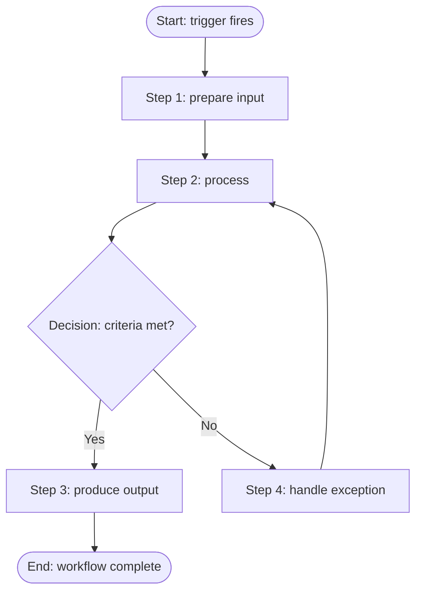

# <Workflow Name>

> One-sentence summary of what this workflow accomplishes and why it exists.

| Field | Value |
|-------|-------|
| Status | Draft / Active / Deprecated |
| Owner | `<team or role>` |
| Last reviewed | `<YYYY-MM-DD>` |
| Version | `<x.y>` |

## Overview

Describe the workflow in two or three sentences. State the goal, the scope (what is and is not covered), and the expected end state once the workflow completes.

## Trigger

What starts this workflow. Be explicit so a reader knows exactly when to run it.

- **Event:** `<what happens>` (for example, an item is created, a schedule fires, a request is received)
- **Preconditions:** `<state that must be true before starting>`
- **Frequency:** `<on demand / scheduled / per event>`

## Actors

Who or what participates. List each actor with its responsibility.

| Actor | Responsibility |
|-------|----------------|
| `<role A>` | `<what they do>` |
| `<role B>` | `<what they do>` |
| `<system or service>` | `<what it does automatically>` |

## Diagram

## Steps

Numbered, ordered actions. Each step names the actor, the action, and the result.

1. **`<Step name>`** — `<actor>` performs `<action>`. Result: `<observable outcome>`.
2. **`<Step name>`** — `<actor>` performs `<action>`. Result: `<observable outcome>`.
3. **`<Step name>`** — `<actor>` performs `<action>`. Result: `<observable outcome>`.
4. **`<Step name>`** — `<actor>` performs `<action>`. Result: `<observable outcome>`.

## Decision points

Branches where the path forks. State the question, the options, and where each option leads.

| Decision | Condition | If yes | If no |
|----------|-----------|--------|-------|
| `<decision name>` | `<criteria evaluated>` | Go to `<step>` | Go to `<step>` |
| `<decision name>` | `<criteria evaluated>` | Go to `<step>` | Go to `<step>` |

## Outputs

What the workflow produces when it finishes.

- **Primary output:** `<artifact, record, or state change>`
- **Side effects:** `<notifications, logs, downstream triggers>`
- **Success criteria:** `<how to confirm the workflow completed correctly>`

## Related pages

Link to adjacent documentation a reader may need next.

- `[<Related workflow>](./<file>.md)`
- `[<Reference or runbook>](./<file>.md)`
- `[<Glossary or concept page>](./<file>.md)`

---

> Example (illustrative — not required): a "New Request Intake" workflow might trigger when a form is submitted, involve a `requester` and a `reviewer`, branch on whether required fields are complete, and output an approved record plus a confirmation notice. Replace all placeholders above with your own values.
